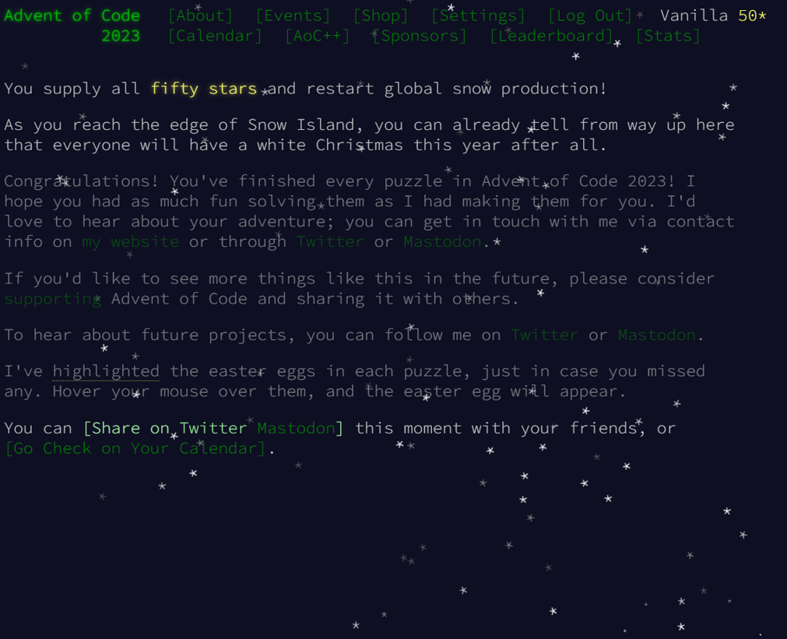

# Advent Of Code 2023
This year, I decided to participate in AoC2023 in a language I am most definitely not familiar with: C++. When looking through my solutions, please note that my focus was not always on finding the most modern or efficient solution, but also to experiment with different features of the C/C++ languages. I have done a more detailed write-up below of my thought process for each day. **Note that I did not switch to a class-based solution design until day 5, so the code may be very cluttered and contain frequent repetitions until then.**

### Day 1
For the first challenge, I simply used iteration over the std::string to find the first and last digit, and multiplied the first digit for each line by 10. For the second challenge, I iterated over the array 9 times, one for each digit, to find the earliest occurrence of a textual version of a digit. The actual check for numeric digits then only has to run to these indices. This solution is still technically in O(n), but it is definitely not clean. Other naive approaches I have seen included replacing text with its corresponding digits, but this leads to problems such as in the string "oneight", where "eight" will not get detected after "one" has been replaced. If I did this challenge again, I would likely use a similar logic, but instead of repeated `find` calls on substrings to find the last instance, I would simply find the first reversed instance of a digit in the reversed string, which would probably perform better, or use [std::string::rfind](https://en.cppreference.com/w/cpp/string/basic_string/rfind), which seems to do this automatically. I wanted to stick to simpler data structures in these first few challenges, to learn more about how I could implement things in somewhat basic C++.

### Day 2
Again, Regex appears as a very logical solution to this problem, especially since only three fixed colours are used. I decided to solve this problem without regex, and, in this challenge, I focused a lot on breaking down the target string into smaller strings, and operating on those to satisfy the "round-based" concept. Both parts of the challenge can be easily solved when using this approach. If I did this challenge again, the main improvement I would make is readability, by better breaking down the methods for splitting the string. Specifically, both here and in the next few challenges, a common issue is that the delimiters in the input are not appended at the end of each line, meaning the final item of each line has to be specially processed outside the loop, leading to repeated code. From day 5 onwards, I try to avoid this, as it constitutes a code smell.

### Day 3
For day 3, the main challenge was somewhat efficiently dealing with locating the position of numbers on a grid and whether they are adjacent to a symbol. I decided to make two grids, one determining the digit, if any, at any given space, and another to determine whether a given space is adjacent to a symbol. For consecutive digits, I multiply the current number by 10 and then add the next digit to find the value of a given sequence of digits. I also keep track of whether any digit was adjacent to a symbol during number construction to find the sum. I think this approach is somewhat reasonable, and the solution mainly suffers from poor readability due to pointer arithmetics (using a 1d array to represent a 2d array), as I wanted to avoid using more modern data structures for the learning experience. Similar to day 2, some issues arise due to missing delimiters at the end of a line, which both led to bugs during development as well as duplicated code. I had a relatively simple idea for the second part of the challenge by replacing my "truth array" (whether the digit is adjacent to any symbol) with an "id array" (the id of the cog to which any digit is adjacent), which can then be used in a simple loop modification to find cog IDs which are adjacent to two numbers and multiply them.

### Day 4
In this challenge, I used vectors and sets for the first time, and started moving away from old C data structures. I used a set to track the winning numbers and calculate the score, which was rather straightforward. For the second challenge, I used a vector as a dynamic array to keep track of the available amount of each scratch card ID. Note that it is not necessary to recursively calculate the results of each scratchcard, and instead simple logic can be used to apply n (number of scratch cards i) extra instances to the next m (number of winning numbers) scratch cards, calculating the full number in a single pass.

### Day 5
On day 5 I decided to begin refactoring my code by wrapping each day's work in a corresponding class that inherits from the abstract class `AoCSolution`, sticking to inline header files to avoid needless complexity (as there is no deeper inheritance structure, it seems unnecessary to create specific header files for this project). The main advantage is that code can be more easily shared between the two parts of the problem, especially code related to the input, and that there is only one main entry point to the program. 

This was for the better, too, since this problem had noticeably more layers of abstraction. The first part is relatively straightforward, although with C++, size_t needs to be used as a data type instead of int, or the values will overflow. Other than that, it is easy enough to make a direct mapping between values and their eventual destinations. The second part, however, is more complicated, and to avoid long computation times, it is necessary to deal with batches as a whole. One trick that helped me a lot here is to convert the [start, range] pairs into [start, end] (inclusive) pairs for both the mappings and the actual seed ranges. Otherwise, for me, it was easy to make errors regarding the inclusion of values at the border, and it was harder to follow the overall thought process. This is a trick I will hopefully keep in mind for future work. 

### Day 6
Interestingly, this challenge could easily be solved using simple maths by directly calculating the minimum and maximum of the given inequality `speed > race_time * charge_speed - charge_speed * charge_speed`, which simplifies to `0 > -speed + race_time * charge_speed - 1 * charge_speed^2` and solving for charge_speed. An alternative approach that doesn't use math (because, well, using math is not much programming...) is to simply iterate over the options from the front and back and find the first and last integer for which the equation holds. Yes, this is more inefficient. I don't really have a good excuse for doing this other than that I didn't wanna look up how to apply the quadratic equation. I was also told here that when using a stringstream with the >> operator function ignores leading whitespaces, which would have been an easier way to parse the input than using regex in this case. But at least regex is already a step easier than the character parsing I did in previous days.

### Day 7 
A pretty reasonable challenge, mostly based on setting up sorting logic for poker hands. To determine the type of hand, I used a hash map which stores the count of each character, which should be fairly performant. For tiebreakers, I simply used a string that holds the order of card values, and check which character of the two hands appears first in it. A likely more performant method I've seen changes the face cards (T,J,Q,K) to higher value ASCII counterparts, which removes the need for an additional string to compare against, since we can just compare ASCII values directly. 

For day 2, I added some additional logic which counts and removes jokers from the hand string, and then uses them as wildcards in the logic to determine how many of each card we have. By first sorting the card_count hash map (meaning it needs to be turned into a vector, so it can be sorted to begin with) by the card count value, this logic works out well, since in this game, it is always beneficial to increase the card count of a card as far as possible (as opposed to, e.g., actual poker, where it might be beneficial to make a straight, or something similar).

Otherwise, the logic is relatively straightforward. I had a single bug where a full hand of jokers (JJJJJ) did not correctly produce five-of-a-kind (since the jokers could not be "converted" into another type of card), but this can simply be fixed with a hardcoded check.  Otherwise, I tried to make some more use of string streams (e.g., streaming the "hand" string into character variables to compare one by one, although it would probably in hindsight have been more performant to just compare the string indices...). I learned that they are quite a bit more powerful than I thought (e.g., they can convert numbers autonomously) if streamed into a number type. I also tried to make more use of const refs to make the programs slightly more performant (I'm not particularly checking for performance, but this just seems like good practice), and I had some issues with circular dependencies that I fixed with forward declarations (since I am working out of single header files...so much for good practice), but other than that, it was pretty chill.

This marks the first out of (hopefully) four weeks of AoC done.

### Day 8
Day 8 was a relatively straightforward implementation with a simple graph node data structure. Each node holds a reference to each of its neighbour nodes, allowing for easy traversal. In part 1, it is not necessary to mark the nodes themselves, instead we can just use the corresponding pointer to keep track of our target node. Here, I mainly learned a bit more about how memory returns work in C++ (e.g., returning a pointer to an object created in a function will lead to an invalid pointer), and somehow solved the problem by wrapping everything in std::shared_ptrs. However, I later learned that this is not actually a safe way to handle memory, and that it needs to be ensured that objects that are wrapped in such pointers are created on by the heap, which allows the pointer structure to safely manage the object. Additionally, when handling graph-like structures, cycles can lead to objects never being deallocated, since they are referenced in a cyclical manner. This means my implementation could (and should) definitely be improved. 

For the second part, simply iterating through the graph does not work anymore, as there are 6 large cycles involved, which have a very large LCM. I implemented a relatively costly LCM evaluation here, based on the assumption that the length of the cycles may not be the same as the initial time it takes to get to the corresponding end-node (which turned out not to be the case). I am certain there are mathematically and computationally more sound implementations than this, even if there is an offset (e.g., [this](https://math.stackexchange.com/questions/2218763/how-to-find-lcm-of-two-numbers-when-one-starts-with-an-offset)), but it got the job done. Checks for t mod m = n (where n is the offset, and m is the cycle length) could also make the checks a bit cleaner, even if it likely wouldn't change much performance-wise.

### Day 9
This was a relatively straightforward challenge. I noticed that we could re-use the same array for each iteration, since we only need to store one number from each pass to compute backwards. Otherwise, there was not really much to say about this.

### Day 10
This challenge was a lot more involved again, although the first part was not much of a problem. I mapped the characters to an enum for easier (more readable) processing, and wrote a function that travels along the direction of the pipe. I then simply iterated along the pipe in both directions until I found a common tile to determine the length.

It turns out this implementation was also very helpful for the second part. Effectively, the goal was to determine which fields are enclosed by the pipe loop. The main problem with doing so was that the grid allowed for adjacent tiles, such as ||, which would still count any tile above as being inside the loop. One relatively elegant solution I found was to artificially increase the grid size so that these adjacent borders don't exist, at which point determining which tiles are outside and which are inside is relatively straightforward. My idea was instead to first find tiles that are clearly on the outside (e.g., touching the wall), and then use that info to find a tile for which I know for sure that an adjacent tile is outside. With that knowledge, we can paint along the edge of the loop to find tiles that are on the outside, but "hidden" on the inside. This method requires a few passes so that all adjacent tiles are properly propagated, but it works fine. 

### Day 11
Unlike on day 10, my solution for part 1 really did not help me with part 2 at all here. I physically built an expanded grid of the "universe", hoping that it would come in handy for part 2. I overcomplicated my logic quite a bit, and still stubbornly refused to use data structures that would probably trivialize a lot of this work, so it took me a while to finish this. 

When I saw part two, I immediately understood how I was supposed to solve part 1 - simply count the number of rows and columns that are empty, and add an additional distance value for them. Once I saw the problem, it was a very easy implementation, but I am slightly annoyed that I spent so much time trying to make the expanded grid work...

### Day 12
Over the last days, I started somewhat consistently moving towards creating my functions outside the class itself and forward declaring them for the class to use. This may not be the ideal solution, since these functions exist outside any defined namespace or class, but it's not much of a problem for the purpose of these challenges. 

Today's problem is a relatively straightforward task of recursively determining the amount of possible solutions for a given set of unknown spaces, similar to a nonogram. I did not have many problems determining that this is a recursive problem, which was enough to solve part one, but I did have to check some existing solutions to notice that in order to solve part two, I would need to use memoization. This is because in many cases, we will need to recompute the amount of possible solutions for a smaller substring, and we can (and sort of have to, to solve part 2) cache those results to massively decrease the computation time.

I did use C++'s feature of allowing reference call parameters here to avoid needlessly copying strings into the recursive call - in fact, the whole string can be processed with just a single instance of it. Maybe (probably) the compiler would do this on its own anyway, but I was proud of myself for at least thinking of it actively. You gotta take the small wins sometimes.

### Day 13
This solution is relatively simple. I thought part 2 might end up having a super large grid that would make it impossible to check every single row/column for symmetry, so in my initial functions (tryFind[Horizontal/Vertical]Symmetry), I tried to first find "candidate rows/columns" based on whether they have direct symmetry between the two rows they encompass, which can be done in a single pass through the grid, i.e., O(n) rather than O(n^2) for checking symmetry across all lines. However, this ended up not being necessary for part 2, so it is not implemented in those functions. Part 2 itself was very simple, since we can just check if there is a single inequality in the symmetry rather than checking for 0 errors. If anything, all the functions in my code kind of do the same thing here, so it would be worth cleaning them up a bunch.

### Day 14
On this day, it is basically again all about memoization. Instead of implementing four different "tilt" functions, I only have a function that tilts all rocks to the left, and then rotate the grid to match the desired direction the rocks should tilt. This probably doesn't actually save any computation (since manipulating the string to rotate is probably quite costly), but it could be made more efficient with better data-structures, and saves a bunch of duplicate code.

Part two again requires us to use a memoization map. However, this time we simply need to track how long it takes us to find a duplicate state. When we find a duplicate state, we know the loop size will stay consistent, since the process is deterministic, and can use this to skip the vast majority of iterations. I have to admit that it was quite difficult to think of this, as the grid at first looks too large to repeat, but it turns out that after about 50-200 iterations, depending on sample input, the grid will in fact repeat. 

### Day  15
In principle, this challenge was all about the implementation of a hash map. I wrote a relatively simple hash-map implementation that uses an array as a container for a linked list of items at each iteration. Of course, in C++, you could use way more convenient data structures, but I thought this was a neat challenge to implement it using relatively basic data types.

### Day 16
This challenge can essentially be solved using "brute force". To avoid loops and duplicate beams, I use a set that keeps track of any time a laser was already encountered at [x,y,direction], which tells us that all tiles that this laser will eventually pass through are already energized, and we can basically disregard it. The rest of the challenge is "basic" ray tracing through an array.

### Day 17
Although I saw some people disagree on the official subreddit, I considered this day by far the most difficult challenge so far. Of course, at its core, this challenge is about implementing a pathfinding algorithm like Dijkstra or A*. To my credit, I noticed almost instantly that the constraint of a maximum 3 steps in the same direction would not coincide with a regular pathfinding implementation, as the same node could be reached from multiple directions, and entering a node from an initially suboptimal direction could still be part of the ultimately optimal solution.

One nuisance here was simply a lack of support in C++ for many default operations on structs, such as having to implement comparators manually, but also having to provide hashes for structs and even, for example, pairs of integers. There is also a strange bug (or maybe some C++ jank I'm not aware of) with the C++ priority queue implementation, where comparisons against INT_MAX will not lead to proper sorting of the queue. This alone cost me a good hour of debugging.

The other issue is the nature of the problem. Effectively, it requires us to think about our pathfinding algorithm as a function of both the position, but also the state by which we entered this position (that being the current direction and the number of steps in this direction), which in turn blows up the graph by a very sizeable amount. However, an advantage is that we don't actually need the path to solve the problem, just the distance. The way I eventually solved this was by sort of dynamically creating "State" nodes as I went along. Starting with a queue consisting of only the start state, we explore all viable options (that being those that fit in the boundary of the grid, that are less costly than the existing best solution, and that follow the constraints of the problem), and add them back to the queue as nodes to explore. This solution, I think, is reasonably efficient, although the code is definitely rather repetitive when it comes to creating the nodes. This is even more so the case in the second part, which basically just changes the boundaries of the direction rules. 

I definitely spent a long time thinking about this problem, because I always considered pathfinding as a problem of making a graph like structure in its entirety first, then traversing this graph efficiently. Here, however, the graph structure both needed to be altered to accommodate the problem, and creating the full graph ahead of time is not an option due to the large state space. A very interesting problem, but not one I would like to repeat anytime soon…

### Day 18
This problem was somewhat similar to that of day 10. Creating the area was a bit more involved, but I had a relatively clean solution of first storing each border coordinate in a map, and then converting this to a vector to get a regular 0-indexed array structure.

Unlike day 10, it was not necessary in this problem to deal with gaps smaller than the grid size, which means I could simply use flood fill to find all inside- and outside tiles. Well, it would have been easier if I had expanded the grid by 1, so I could run a single flood-fill that was guaranteed to hit an outside tile (instead of four flood fills from each of the corner tiles). But I didn't think of that until after I implemented it. It was a good reminder of previous challenges and a way to try out an alternative solution.

Part two was straight up designed not to allow programmatic solutions. The most common solution I saw here, which I ended up implementing, is using the Shoelace theorem to calculate the inside area of the pit, then adding half the perimeter to accommodate for the outer side of the perimeter (since Shoelace basically starts in the "center" of the pixel) and adding to account for a quarter corner tile on each corner. I would be lying if I said I knew to apply this equation before checking online, though.

### Day 19
Again a bit of a throwback challenge to day 5, dealing with range splitting, this time based on several values. The values necessitate a kind of container, like a struct, to keep track of the current range across all variables, but the challenge is otherwise not very noteworthy. I think I overcomplicated my abstraction a bit with the "Rule" struct, but it ended up working out fine, to be honest.

### Day 20
The first time I ended up using (and immediately regretting) object-oriented programming in C++. Basically just made a bunch of classes for the different types of signals.  First, I wanted to link them directly, so that each signal could call its targets, but it doesn't really work well with the requirement of a "breadth-first" parsing of signals. So instead, each signal just returns the "pulses" it would like to send, and the targets, and the main program takes care of both counting them and forwarding them via a queue.

Part one was pretty uneventful and, I think, relatively decently implemented. Part two was a bit of a pain. It first required finding out what is actually going on in the state machine. I would like to say I had the patience to do this on my own, but I would be lying. Once you find out how the whole machine is set up, it is pretty clear that the application is the same as on day 8 (finding the LCM of a set of cycles).  

This truly is a bit of a "puzzle" challenge that requires understanding the inner workings of the state machine. Not least of all, because one actually has to track when each signal becomes active, as it will become inactive again before the button-cycle ends. This also means that we need to understand (or, to be honest, in my case, just hope the guy who made the challenge wasn't completely insane) that there could theoretically be a state machine where all four signals become active during the same button press (LCM of the cycles), but are not active at the same time, thus not activating the final signal. I took my chances that this would not be the case after getting a fifteen digit result as the LCM, and thankfully I was correct.

Again, I could have done a more simple or built-in LCM solution here, and again I failed to do so because I thought the cycle offset was different from the cycle length. However, I figured out now that should this actually happen in the future, the Chinese Remainder Theorem SHOULD have me covered (unless I understood it wrong, lol).

### Day 21
This part one was a really straightforward implementation (I used a breadth-first type traversal, since the distance cost is equal for all steps). Unfortunately, the second part was anything but. At this point, with the holidays close by, and the challenges becoming a lot more abstract, I've allowed myself a little peek at reddit now and then to get some help with the solutions for these kinds of problems that sound more mathematical in nature than anything else. And I was sort of correct in my assumption - the simplest way, and the way I ended up choosing, was fitting a function to the data via a Lagrange approximation. I don't reaaally have many other ideas for how to do this, and I assume by the puzzle setup that this is in some way the intended solution. I think you could probably calculate the same thing in a loop programmatically by finding some function that models the increase in covered steps without an approximation.

### Day 22
Again, today was a problem that was more about how to frame the problem rather than a specific algorithm, which I tend to enjoy more. After sorting all blocks by their initial height, we can iteratively drop them down as far as they will go. To solve part one, I wrote a function that returns all blocks that another block is supported by. If a block is supported by 0 or more than one blocks, there is no problem. If a block is ever supported by only a single other block, that block cannot be removed (because the current block would then drop). Interestingly, this function was also really helpful for part two. We can simply build a kind of "dependency map", which holds information on what blocks currently support another block. If that dependency map is empty, the block will fall and get added to the removed blocks list. Blocks that were on the ground to begin with skip the dependency map entirely, so they are not affected.

### Day 23
This challenge of finding the longest path between two tiles appears to be an NP-hard problem. While the first part can be solved with basically any type of traversal algorithm in a reasonable amount of time, the second part requires at least some amount of computation optimization due to the amount of possible paths. We also have to keep memory optimization in mind, at least when, as I initially planned to do, copying around the visited node set at every turn (in part two, this just blows up your RAM completely). In the end, I settled for a depth-first traversal for part two, with a needlessly complicated implementation of the visited set. Basically, I have both a list (vector) of the current visited set, which I can use to backtrack n steps and remove them (when going back to a previous turn), as well as an actual set, which I can use to look up if an item is in it. This set is actually **necessary** for part two. Without it, computation takes far too long. I've seen other possible optimizations, such as skipping the last turn entirely (at the last turn, we HAVE to move toward the goal. Otherwise, the path cannot lead to it), and I'm sure many things could be improved about my DFS implementation (I think I should have just taken the recursion-pill in this case, it would have made the code much more readable).

### Day 24
Due to Christmas Eve being celebrated on the 24th, I did cheat a bit here and basically verbatim [copied a solution from reddit](https://www.reddit.com/r/adventofcode/comments/18pnycy/comment/keqann8/?utm_source=share&utm_medium=web2x&context=3), which already sort of cheated in its own implementation. While part one uses a relatively simple math-based solution (which I researched on my own), part two basically boils down to an equation system over 9 unknowns in 4-dimensional space (the collision time of at least 3 meteors, as well as x/y/z/vx/vy/vz of our rock. We have, of course, plenty of known variables (position and velocity of meteors) to choose from, so creating the equation system is relatively simple. In the end, though, it comes down to simply deferring this problem to a general purpose solver, which is not very satisfying. There appear to be some legitimately programming-based solutions to this problem, but they are far more complicated than I could hope to understand, especially in such a short timeframe. I'm quite happy not having to see more linear algebra outside of machine learning models anymore.

### Day 25
To cap it off, a reasonable challenge about splitting a graph. Of course, the naive solution is to simply iterate over all possible combinations of three edges, remove them, and see if the graph is split (if all nodes can be reached from any arbitrary node). However, this solution takes too long. A clever trick that I found online which I ended up implementing is to order edges based on their cost. The cost being: If we remove an edge, how many hops does it take to move between the two nodes it used to connect? This kind of operates based on the assumption that the graph is otherwise relatively densely connected. If this is the case, then removing one of the three edges connecting the two sides of the graph will require re-routing over a different connection between them, leading to a higher cost. It is still not guaranteed that the three highest cost edges are the ones we want to remove, so we still need to iterate through them, but it will be much less costly. 

In the end, even after some hardships, it is done.
